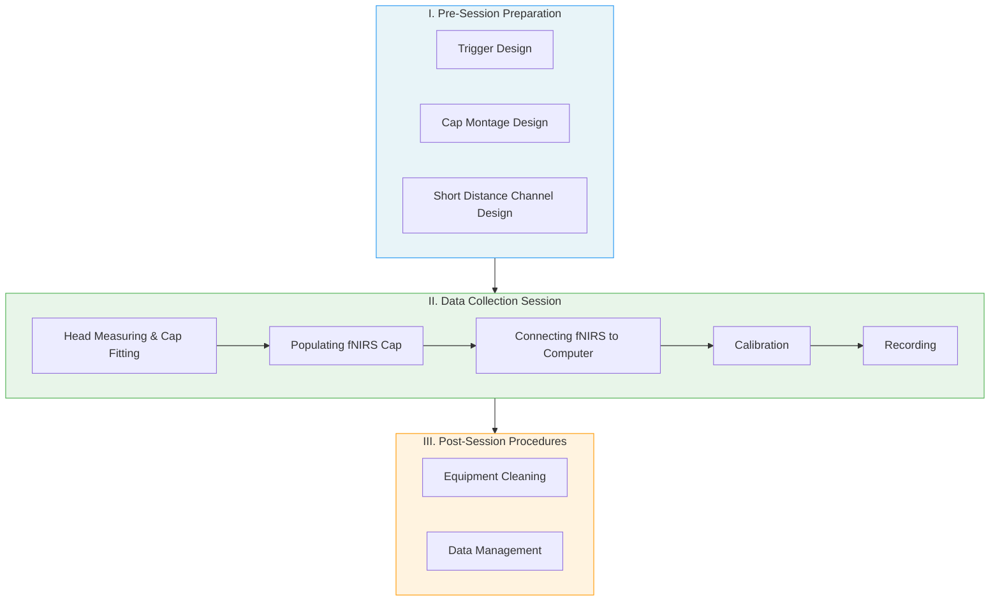

# fNIRS SOP Overview

1. Software Overview
   - Cap Montage Design (fOLD, NIRSite)
   - Data Acquisition (Aurora, PsychoPy)
   - Data Analysis (Satori/Turbo Satori)

2. General Procedure

```mermaid
flowchart TD
    subgraph Preparation["I. Pre-Session Preparation"]
        A[Trigger Design]
        B[Cap Montage Design]
        C[Short Distance Channel Design]
    end

    subgraph Session["II. Data Collection Session"]
        D[Head Measuring & Cap Fitting] --> E[Populating fNIRS Cap]
        E --> F[Connecting fNIRS to Computer]
        F --> G[Calibration]
        G --> H[Recording]
    end

    subgraph PostSession["III. Post-Session Procedures"]
        I[Equipment Cleaning]
        J[Data Management]
    end

    Preparation --> Session
    Session --> PostSession

    style Preparation fill:#e8f4f8,stroke:#2196F3
    style Session fill:#e8f5e9,stroke:#4CAF50
    style PostSession fill:#fff3e0,stroke:#FF9800
```
